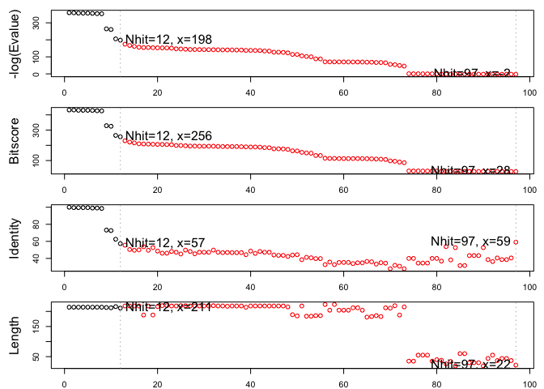

Class11: Structurtal Bioinformatics
================

The PDB database
----------------

The [PDB](http://www.rcsb.org/) is the main repository for biomolecular structure data.

Here we examine the contents of the PDB:

> Q1. Q1: Download a CSV file from the PDB site (accessible from “Analyze” &gt; “PDB Statistics” &gt; “by Experimental Method and Molecular Type”. Move this CSV file into your RStudio project and determine the percentage of structures solved by X-Ray and Electron Microscopy. From the website what proportion of structures are protein?

``` r
db <- read.csv("Data Export Summary.csv", row.names=1)
head(db)
```

    ##                     Proteins Nucleic.Acids Protein.NA.Complex Other  Total
    ## X-Ray                 126880          2012               6547     8 135447
    ## NMR                    11062          1279                259     8  12608
    ## Electron Microscopy     2277            31                800     0   3108
    ## Other                    256             4                  6    13    279
    ## Multi Method             129             5                  2     1    137

How many are X-Ray, etc...

``` r
(db$Total/sum(db$Total)) * 100
```

    ## [1] 89.35736481  8.31777489  2.05041595  0.18406244  0.09038191

What precent are Protein...

``` r
(sum(db$Proteins)/sum(db$Total)) * 100
```

    ## [1] 92.75955

We could also try the datapasta package and copy from website and "Addins" &gt; "Paste as data.frame"...

``` r
library(datapasta)

tmp <- data.frame(stringsAsFactors=FALSE,
   Experimental.Method = c("X-Ray", "Other", "NMR", "Multi Method",
                           "Electron Microscopy", "Total"),
              Proteins = c(126880, 256, 11062, 129, 2277, 140604),
         Nucleic.Acids = c(2012, 4, 1279, 5, 31, 3331),
    ProteinComplex = c(6547, 6, 259, 2, 800, 7614),
                 Other = c(8, 13, 8, 1, 0, 30),
                 Total = c(135447, 279, 12608, 137, 3108, 151579)
)
```

> Q2. Type HIV in the PDB website search box on the home page and determine how many HIV-1 protease structures are in the current PDB?

There are 1157 as of 2019-05-07 See: <http://www.rcsb.org/pdb/results/results.do?tabtoshow=Current&qrid=40D8F533>

\#\# Section 3 Usding Bio3D

``` r
library(bio3d)

pdb <- read.pdb("1hsg.pdb")
pdb
```

    ## 
    ##  Call:  read.pdb(file = "1hsg.pdb")
    ## 
    ##    Total Models#: 1
    ##      Total Atoms#: 1686,  XYZs#: 5058  Chains#: 2  (values: A B)
    ## 
    ##      Protein Atoms#: 1514  (residues/Calpha atoms#: 198)
    ##      Nucleic acid Atoms#: 0  (residues/phosphate atoms#: 0)
    ## 
    ##      Non-protein/nucleic Atoms#: 172  (residues: 128)
    ##      Non-protein/nucleic resid values: [ HOH (127), MK1 (1) ]
    ## 
    ##    Protein sequence:
    ##       PQITLWQRPLVTIKIGGQLKEALLDTGADDTVLEEMSLPGRWKPKMIGGIGGFIKVRQYD
    ##       QILIEICGHKAIGTVLVGPTPVNIIGRNLLTQIGCTLNFPQITLWQRPLVTIKIGGQLKE
    ##       ALLDTGADDTVLEEMSLPGRWKPKMIGGIGGFIKVRQYDQILIEICGHKAIGTVLVGPTP
    ##       VNIIGRNLLTQIGCTLNF
    ## 
    ## + attr: atom, xyz, seqres, helix, sheet,
    ##         calpha, remark, call

``` r
aa321(pdb$atom$resid)
```

    ## Warning in FUN(X[[i]], ...): Unknown 3-letters code for aminoacid: MK1

    ## Warning in FUN(X[[i]], ...): Unknown 3-letters code for aminoacid: MK1

    ## Warning in FUN(X[[i]], ...): Unknown 3-letters code for aminoacid: MK1

    ## Warning in FUN(X[[i]], ...): Unknown 3-letters code for aminoacid: MK1

    ## Warning in FUN(X[[i]], ...): Unknown 3-letters code for aminoacid: MK1

    ## Warning in FUN(X[[i]], ...): Unknown 3-letters code for aminoacid: MK1

    ## Warning in FUN(X[[i]], ...): Unknown 3-letters code for aminoacid: MK1

    ## Warning in FUN(X[[i]], ...): Unknown 3-letters code for aminoacid: MK1

    ## Warning in FUN(X[[i]], ...): Unknown 3-letters code for aminoacid: MK1

    ## Warning in FUN(X[[i]], ...): Unknown 3-letters code for aminoacid: MK1

    ## Warning in FUN(X[[i]], ...): Unknown 3-letters code for aminoacid: MK1

    ## Warning in FUN(X[[i]], ...): Unknown 3-letters code for aminoacid: MK1

    ## Warning in FUN(X[[i]], ...): Unknown 3-letters code for aminoacid: MK1

    ## Warning in FUN(X[[i]], ...): Unknown 3-letters code for aminoacid: MK1

    ## Warning in FUN(X[[i]], ...): Unknown 3-letters code for aminoacid: MK1

    ## Warning in FUN(X[[i]], ...): Unknown 3-letters code for aminoacid: MK1

    ## Warning in FUN(X[[i]], ...): Unknown 3-letters code for aminoacid: MK1

    ## Warning in FUN(X[[i]], ...): Unknown 3-letters code for aminoacid: MK1

    ## Warning in FUN(X[[i]], ...): Unknown 3-letters code for aminoacid: MK1

    ## Warning in FUN(X[[i]], ...): Unknown 3-letters code for aminoacid: MK1

    ## Warning in FUN(X[[i]], ...): Unknown 3-letters code for aminoacid: MK1

    ## Warning in FUN(X[[i]], ...): Unknown 3-letters code for aminoacid: MK1

    ## Warning in FUN(X[[i]], ...): Unknown 3-letters code for aminoacid: MK1

    ## Warning in FUN(X[[i]], ...): Unknown 3-letters code for aminoacid: MK1

    ## Warning in FUN(X[[i]], ...): Unknown 3-letters code for aminoacid: MK1

    ## Warning in FUN(X[[i]], ...): Unknown 3-letters code for aminoacid: MK1

    ## Warning in FUN(X[[i]], ...): Unknown 3-letters code for aminoacid: MK1

    ## Warning in FUN(X[[i]], ...): Unknown 3-letters code for aminoacid: MK1

    ## Warning in FUN(X[[i]], ...): Unknown 3-letters code for aminoacid: MK1

    ## Warning in FUN(X[[i]], ...): Unknown 3-letters code for aminoacid: MK1

    ## Warning in FUN(X[[i]], ...): Unknown 3-letters code for aminoacid: MK1

    ## Warning in FUN(X[[i]], ...): Unknown 3-letters code for aminoacid: MK1

    ## Warning in FUN(X[[i]], ...): Unknown 3-letters code for aminoacid: MK1

    ## Warning in FUN(X[[i]], ...): Unknown 3-letters code for aminoacid: MK1

    ## Warning in FUN(X[[i]], ...): Unknown 3-letters code for aminoacid: MK1

    ## Warning in FUN(X[[i]], ...): Unknown 3-letters code for aminoacid: MK1

    ## Warning in FUN(X[[i]], ...): Unknown 3-letters code for aminoacid: MK1

    ## Warning in FUN(X[[i]], ...): Unknown 3-letters code for aminoacid: MK1

    ## Warning in FUN(X[[i]], ...): Unknown 3-letters code for aminoacid: MK1

    ## Warning in FUN(X[[i]], ...): Unknown 3-letters code for aminoacid: MK1

    ## Warning in FUN(X[[i]], ...): Unknown 3-letters code for aminoacid: MK1

    ## Warning in FUN(X[[i]], ...): Unknown 3-letters code for aminoacid: MK1

    ## Warning in FUN(X[[i]], ...): Unknown 3-letters code for aminoacid: MK1

    ## Warning in FUN(X[[i]], ...): Unknown 3-letters code for aminoacid: MK1

    ## Warning in FUN(X[[i]], ...): Unknown 3-letters code for aminoacid: MK1

    ## Warning in FUN(X[[i]], ...): Unknown 3-letters code for aminoacid: HOH

    ## Warning in FUN(X[[i]], ...): Unknown 3-letters code for aminoacid: HOH

    ## Warning in FUN(X[[i]], ...): Unknown 3-letters code for aminoacid: HOH

    ## Warning in FUN(X[[i]], ...): Unknown 3-letters code for aminoacid: HOH

    ## Warning in FUN(X[[i]], ...): Unknown 3-letters code for aminoacid: HOH

    ## Warning in FUN(X[[i]], ...): Unknown 3-letters code for aminoacid: HOH

    ## Warning in FUN(X[[i]], ...): Unknown 3-letters code for aminoacid: HOH

    ## Warning in FUN(X[[i]], ...): Unknown 3-letters code for aminoacid: HOH

    ## Warning in FUN(X[[i]], ...): Unknown 3-letters code for aminoacid: HOH

    ## Warning in FUN(X[[i]], ...): Unknown 3-letters code for aminoacid: HOH

    ## Warning in FUN(X[[i]], ...): Unknown 3-letters code for aminoacid: HOH

    ## Warning in FUN(X[[i]], ...): Unknown 3-letters code for aminoacid: HOH

    ## Warning in FUN(X[[i]], ...): Unknown 3-letters code for aminoacid: HOH

    ## Warning in FUN(X[[i]], ...): Unknown 3-letters code for aminoacid: HOH

    ## Warning in FUN(X[[i]], ...): Unknown 3-letters code for aminoacid: HOH

    ## Warning in FUN(X[[i]], ...): Unknown 3-letters code for aminoacid: HOH

    ## Warning in FUN(X[[i]], ...): Unknown 3-letters code for aminoacid: HOH

    ## Warning in FUN(X[[i]], ...): Unknown 3-letters code for aminoacid: HOH

    ## Warning in FUN(X[[i]], ...): Unknown 3-letters code for aminoacid: HOH

    ## Warning in FUN(X[[i]], ...): Unknown 3-letters code for aminoacid: HOH

    ## Warning in FUN(X[[i]], ...): Unknown 3-letters code for aminoacid: HOH

    ## Warning in FUN(X[[i]], ...): Unknown 3-letters code for aminoacid: HOH

    ## Warning in FUN(X[[i]], ...): Unknown 3-letters code for aminoacid: HOH

    ## Warning in FUN(X[[i]], ...): Unknown 3-letters code for aminoacid: HOH

    ## Warning in FUN(X[[i]], ...): Unknown 3-letters code for aminoacid: HOH

    ## Warning in FUN(X[[i]], ...): Unknown 3-letters code for aminoacid: HOH

    ## Warning in FUN(X[[i]], ...): Unknown 3-letters code for aminoacid: HOH

    ## Warning in FUN(X[[i]], ...): Unknown 3-letters code for aminoacid: HOH

    ## Warning in FUN(X[[i]], ...): Unknown 3-letters code for aminoacid: HOH

    ## Warning in FUN(X[[i]], ...): Unknown 3-letters code for aminoacid: HOH

    ## Warning in FUN(X[[i]], ...): Unknown 3-letters code for aminoacid: HOH

    ## Warning in FUN(X[[i]], ...): Unknown 3-letters code for aminoacid: HOH

    ## Warning in FUN(X[[i]], ...): Unknown 3-letters code for aminoacid: HOH

    ## Warning in FUN(X[[i]], ...): Unknown 3-letters code for aminoacid: HOH

    ## Warning in FUN(X[[i]], ...): Unknown 3-letters code for aminoacid: HOH

    ## Warning in FUN(X[[i]], ...): Unknown 3-letters code for aminoacid: HOH

    ## Warning in FUN(X[[i]], ...): Unknown 3-letters code for aminoacid: HOH

    ## Warning in FUN(X[[i]], ...): Unknown 3-letters code for aminoacid: HOH

    ## Warning in FUN(X[[i]], ...): Unknown 3-letters code for aminoacid: HOH

    ## Warning in FUN(X[[i]], ...): Unknown 3-letters code for aminoacid: HOH

    ## Warning in FUN(X[[i]], ...): Unknown 3-letters code for aminoacid: HOH

    ## Warning in FUN(X[[i]], ...): Unknown 3-letters code for aminoacid: HOH

    ## Warning in FUN(X[[i]], ...): Unknown 3-letters code for aminoacid: HOH

    ## Warning in FUN(X[[i]], ...): Unknown 3-letters code for aminoacid: HOH

    ## Warning in FUN(X[[i]], ...): Unknown 3-letters code for aminoacid: HOH

    ## Warning in FUN(X[[i]], ...): Unknown 3-letters code for aminoacid: HOH

    ## Warning in FUN(X[[i]], ...): Unknown 3-letters code for aminoacid: HOH

    ## Warning in FUN(X[[i]], ...): Unknown 3-letters code for aminoacid: HOH

    ## Warning in FUN(X[[i]], ...): Unknown 3-letters code for aminoacid: HOH

    ## Warning in FUN(X[[i]], ...): Unknown 3-letters code for aminoacid: HOH

    ## Warning in FUN(X[[i]], ...): Unknown 3-letters code for aminoacid: HOH

    ## Warning in FUN(X[[i]], ...): Unknown 3-letters code for aminoacid: HOH

    ## Warning in FUN(X[[i]], ...): Unknown 3-letters code for aminoacid: HOH

    ## Warning in FUN(X[[i]], ...): Unknown 3-letters code for aminoacid: HOH

    ## Warning in FUN(X[[i]], ...): Unknown 3-letters code for aminoacid: HOH

    ## Warning in FUN(X[[i]], ...): Unknown 3-letters code for aminoacid: HOH

    ## Warning in FUN(X[[i]], ...): Unknown 3-letters code for aminoacid: HOH

    ## Warning in FUN(X[[i]], ...): Unknown 3-letters code for aminoacid: HOH

    ## Warning in FUN(X[[i]], ...): Unknown 3-letters code for aminoacid: HOH

    ## Warning in FUN(X[[i]], ...): Unknown 3-letters code for aminoacid: HOH

    ## Warning in FUN(X[[i]], ...): Unknown 3-letters code for aminoacid: HOH

    ## Warning in FUN(X[[i]], ...): Unknown 3-letters code for aminoacid: HOH

    ## Warning in FUN(X[[i]], ...): Unknown 3-letters code for aminoacid: HOH

    ## Warning in FUN(X[[i]], ...): Unknown 3-letters code for aminoacid: HOH

    ## Warning in FUN(X[[i]], ...): Unknown 3-letters code for aminoacid: HOH

    ## Warning in FUN(X[[i]], ...): Unknown 3-letters code for aminoacid: HOH

    ## Warning in FUN(X[[i]], ...): Unknown 3-letters code for aminoacid: HOH

    ## Warning in FUN(X[[i]], ...): Unknown 3-letters code for aminoacid: HOH

    ## Warning in FUN(X[[i]], ...): Unknown 3-letters code for aminoacid: HOH

    ## Warning in FUN(X[[i]], ...): Unknown 3-letters code for aminoacid: HOH

    ## Warning in FUN(X[[i]], ...): Unknown 3-letters code for aminoacid: HOH

    ## Warning in FUN(X[[i]], ...): Unknown 3-letters code for aminoacid: HOH

    ## Warning in FUN(X[[i]], ...): Unknown 3-letters code for aminoacid: HOH

    ## Warning in FUN(X[[i]], ...): Unknown 3-letters code for aminoacid: HOH

    ## Warning in FUN(X[[i]], ...): Unknown 3-letters code for aminoacid: HOH

    ## Warning in FUN(X[[i]], ...): Unknown 3-letters code for aminoacid: HOH

    ## Warning in FUN(X[[i]], ...): Unknown 3-letters code for aminoacid: HOH

    ## Warning in FUN(X[[i]], ...): Unknown 3-letters code for aminoacid: HOH

    ## Warning in FUN(X[[i]], ...): Unknown 3-letters code for aminoacid: HOH

    ## Warning in FUN(X[[i]], ...): Unknown 3-letters code for aminoacid: HOH

    ## Warning in FUN(X[[i]], ...): Unknown 3-letters code for aminoacid: HOH

    ## Warning in FUN(X[[i]], ...): Unknown 3-letters code for aminoacid: HOH

    ## Warning in FUN(X[[i]], ...): Unknown 3-letters code for aminoacid: HOH

    ## Warning in FUN(X[[i]], ...): Unknown 3-letters code for aminoacid: HOH

    ## Warning in FUN(X[[i]], ...): Unknown 3-letters code for aminoacid: HOH

    ## Warning in FUN(X[[i]], ...): Unknown 3-letters code for aminoacid: HOH

    ## Warning in FUN(X[[i]], ...): Unknown 3-letters code for aminoacid: HOH

    ## Warning in FUN(X[[i]], ...): Unknown 3-letters code for aminoacid: HOH

    ## Warning in FUN(X[[i]], ...): Unknown 3-letters code for aminoacid: HOH

    ## Warning in FUN(X[[i]], ...): Unknown 3-letters code for aminoacid: HOH

    ## Warning in FUN(X[[i]], ...): Unknown 3-letters code for aminoacid: HOH

    ## Warning in FUN(X[[i]], ...): Unknown 3-letters code for aminoacid: HOH

    ## Warning in FUN(X[[i]], ...): Unknown 3-letters code for aminoacid: HOH

    ## Warning in FUN(X[[i]], ...): Unknown 3-letters code for aminoacid: HOH

    ## Warning in FUN(X[[i]], ...): Unknown 3-letters code for aminoacid: HOH

    ## Warning in FUN(X[[i]], ...): Unknown 3-letters code for aminoacid: HOH

    ## Warning in FUN(X[[i]], ...): Unknown 3-letters code for aminoacid: HOH

    ## Warning in FUN(X[[i]], ...): Unknown 3-letters code for aminoacid: HOH

    ## Warning in FUN(X[[i]], ...): Unknown 3-letters code for aminoacid: HOH

    ## Warning in FUN(X[[i]], ...): Unknown 3-letters code for aminoacid: HOH

    ## Warning in FUN(X[[i]], ...): Unknown 3-letters code for aminoacid: HOH

    ## Warning in FUN(X[[i]], ...): Unknown 3-letters code for aminoacid: HOH

    ## Warning in FUN(X[[i]], ...): Unknown 3-letters code for aminoacid: HOH

    ## Warning in FUN(X[[i]], ...): Unknown 3-letters code for aminoacid: HOH

    ## Warning in FUN(X[[i]], ...): Unknown 3-letters code for aminoacid: HOH

    ## Warning in FUN(X[[i]], ...): Unknown 3-letters code for aminoacid: HOH

    ## Warning in FUN(X[[i]], ...): Unknown 3-letters code for aminoacid: HOH

    ## Warning in FUN(X[[i]], ...): Unknown 3-letters code for aminoacid: HOH

    ## Warning in FUN(X[[i]], ...): Unknown 3-letters code for aminoacid: HOH

    ## Warning in FUN(X[[i]], ...): Unknown 3-letters code for aminoacid: HOH

    ## Warning in FUN(X[[i]], ...): Unknown 3-letters code for aminoacid: HOH

    ## Warning in FUN(X[[i]], ...): Unknown 3-letters code for aminoacid: HOH

    ## Warning in FUN(X[[i]], ...): Unknown 3-letters code for aminoacid: HOH

    ## Warning in FUN(X[[i]], ...): Unknown 3-letters code for aminoacid: HOH

    ## Warning in FUN(X[[i]], ...): Unknown 3-letters code for aminoacid: HOH

    ## Warning in FUN(X[[i]], ...): Unknown 3-letters code for aminoacid: HOH

    ## Warning in FUN(X[[i]], ...): Unknown 3-letters code for aminoacid: HOH

    ## Warning in FUN(X[[i]], ...): Unknown 3-letters code for aminoacid: HOH

    ## Warning in FUN(X[[i]], ...): Unknown 3-letters code for aminoacid: HOH

    ## Warning in FUN(X[[i]], ...): Unknown 3-letters code for aminoacid: HOH

    ## Warning in FUN(X[[i]], ...): Unknown 3-letters code for aminoacid: HOH

    ## Warning in FUN(X[[i]], ...): Unknown 3-letters code for aminoacid: HOH

    ## Warning in FUN(X[[i]], ...): Unknown 3-letters code for aminoacid: HOH

    ## Warning in FUN(X[[i]], ...): Unknown 3-letters code for aminoacid: HOH

    ## Warning in FUN(X[[i]], ...): Unknown 3-letters code for aminoacid: HOH

    ## Warning in FUN(X[[i]], ...): Unknown 3-letters code for aminoacid: HOH

    ## Warning in FUN(X[[i]], ...): Unknown 3-letters code for aminoacid: HOH

    ##    [1] "P" "P" "P" "P" "P" "P" "P" "Q" "Q" "Q" "Q" "Q" "Q" "Q" "Q" "Q" "I"
    ##   [18] "I" "I" "I" "I" "I" "I" "I" "T" "T" "T" "T" "T" "T" "T" "L" "L" "L"
    ##   [35] "L" "L" "L" "L" "L" "W" "W" "W" "W" "W" "W" "W" "W" "W" "W" "W" "W"
    ##   [52] "W" "W" "Q" "Q" "Q" "Q" "Q" "Q" "Q" "Q" "Q" "R" "R" "R" "R" "R" "R"
    ##   [69] "R" "R" "R" "R" "R" "P" "P" "P" "P" "P" "P" "P" "L" "L" "L" "L" "L"
    ##   [86] "L" "L" "L" "V" "V" "V" "V" "V" "V" "V" "T" "T" "T" "T" "T" "T" "T"
    ##  [103] "I" "I" "I" "I" "I" "I" "I" "I" "K" "K" "K" "K" "K" "K" "K" "K" "K"
    ##  [120] "I" "I" "I" "I" "I" "I" "I" "I" "G" "G" "G" "G" "G" "G" "G" "G" "Q"
    ##  [137] "Q" "Q" "Q" "Q" "Q" "Q" "Q" "Q" "L" "L" "L" "L" "L" "L" "L" "L" "K"
    ##  [154] "K" "K" "K" "K" "K" "K" "K" "K" "E" "E" "E" "E" "E" "E" "E" "E" "E"
    ##  [171] "A" "A" "A" "A" "A" "L" "L" "L" "L" "L" "L" "L" "L" "L" "L" "L" "L"
    ##  [188] "L" "L" "L" "L" "D" "D" "D" "D" "D" "D" "D" "D" "T" "T" "T" "T" "T"
    ##  [205] "T" "T" "G" "G" "G" "G" "A" "A" "A" "A" "A" "D" "D" "D" "D" "D" "D"
    ##  [222] "D" "D" "D" "D" "D" "D" "D" "D" "D" "D" "T" "T" "T" "T" "T" "T" "T"
    ##  [239] "V" "V" "V" "V" "V" "V" "V" "L" "L" "L" "L" "L" "L" "L" "L" "E" "E"
    ##  [256] "E" "E" "E" "E" "E" "E" "E" "E" "E" "E" "E" "E" "E" "E" "E" "E" "M"
    ##  [273] "M" "M" "M" "M" "M" "M" "M" "S" "S" "S" "S" "S" "S" "L" "L" "L" "L"
    ##  [290] "L" "L" "L" "L" "P" "P" "P" "P" "P" "P" "P" "G" "G" "G" "G" "R" "R"
    ##  [307] "R" "R" "R" "R" "R" "R" "R" "R" "R" "W" "W" "W" "W" "W" "W" "W" "W"
    ##  [324] "W" "W" "W" "W" "W" "W" "K" "K" "K" "K" "K" "K" "K" "K" "K" "P" "P"
    ##  [341] "P" "P" "P" "P" "P" "K" "K" "K" "K" "K" "K" "K" "K" "K" "M" "M" "M"
    ##  [358] "M" "M" "M" "M" "M" "I" "I" "I" "I" "I" "I" "I" "I" "G" "G" "G" "G"
    ##  [375] "G" "G" "G" "G" "I" "I" "I" "I" "I" "I" "I" "I" "G" "G" "G" "G" "G"
    ##  [392] "G" "G" "G" "F" "F" "F" "F" "F" "F" "F" "F" "F" "F" "F" "I" "I" "I"
    ##  [409] "I" "I" "I" "I" "I" "K" "K" "K" "K" "K" "K" "K" "K" "K" "V" "V" "V"
    ##  [426] "V" "V" "V" "V" "R" "R" "R" "R" "R" "R" "R" "R" "R" "R" "R" "Q" "Q"
    ##  [443] "Q" "Q" "Q" "Q" "Q" "Q" "Q" "Y" "Y" "Y" "Y" "Y" "Y" "Y" "Y" "Y" "Y"
    ##  [460] "Y" "Y" "D" "D" "D" "D" "D" "D" "D" "D" "Q" "Q" "Q" "Q" "Q" "Q" "Q"
    ##  [477] "Q" "Q" "I" "I" "I" "I" "I" "I" "I" "I" "L" "L" "L" "L" "L" "L" "L"
    ##  [494] "L" "I" "I" "I" "I" "I" "I" "I" "I" "E" "E" "E" "E" "E" "E" "E" "E"
    ##  [511] "E" "I" "I" "I" "I" "I" "I" "I" "I" "C" "C" "C" "C" "C" "C" "G" "G"
    ##  [528] "G" "G" "H" "H" "H" "H" "H" "H" "H" "H" "H" "H" "K" "K" "K" "K" "K"
    ##  [545] "K" "K" "K" "K" "A" "A" "A" "A" "A" "I" "I" "I" "I" "I" "I" "I" "I"
    ##  [562] "G" "G" "G" "G" "T" "T" "T" "T" "T" "T" "T" "V" "V" "V" "V" "V" "V"
    ##  [579] "V" "L" "L" "L" "L" "L" "L" "L" "L" "V" "V" "V" "V" "V" "V" "V" "G"
    ##  [596] "G" "G" "G" "P" "P" "P" "P" "P" "P" "P" "T" "T" "T" "T" "T" "T" "T"
    ##  [613] "P" "P" "P" "P" "P" "P" "P" "V" "V" "V" "V" "V" "V" "V" "N" "N" "N"
    ##  [630] "N" "N" "N" "N" "N" "I" "I" "I" "I" "I" "I" "I" "I" "I" "I" "I" "I"
    ##  [647] "I" "I" "I" "I" "G" "G" "G" "G" "R" "R" "R" "R" "R" "R" "R" "R" "R"
    ##  [664] "R" "R" "N" "N" "N" "N" "N" "N" "N" "N" "L" "L" "L" "L" "L" "L" "L"
    ##  [681] "L" "L" "L" "L" "L" "L" "L" "L" "L" "T" "T" "T" "T" "T" "T" "T" "Q"
    ##  [698] "Q" "Q" "Q" "Q" "Q" "Q" "Q" "Q" "I" "I" "I" "I" "I" "I" "I" "I" "G"
    ##  [715] "G" "G" "G" "C" "C" "C" "C" "C" "C" "T" "T" "T" "T" "T" "T" "T" "L"
    ##  [732] "L" "L" "L" "L" "L" "L" "L" "N" "N" "N" "N" "N" "N" "N" "N" "F" "F"
    ##  [749] "F" "F" "F" "F" "F" "F" "F" "F" "F" "P" "P" "P" "P" "P" "P" "P" "Q"
    ##  [766] "Q" "Q" "Q" "Q" "Q" "Q" "Q" "Q" "I" "I" "I" "I" "I" "I" "I" "I" "T"
    ##  [783] "T" "T" "T" "T" "T" "T" "L" "L" "L" "L" "L" "L" "L" "L" "W" "W" "W"
    ##  [800] "W" "W" "W" "W" "W" "W" "W" "W" "W" "W" "W" "Q" "Q" "Q" "Q" "Q" "Q"
    ##  [817] "Q" "Q" "Q" "R" "R" "R" "R" "R" "R" "R" "R" "R" "R" "R" "P" "P" "P"
    ##  [834] "P" "P" "P" "P" "L" "L" "L" "L" "L" "L" "L" "L" "V" "V" "V" "V" "V"
    ##  [851] "V" "V" "T" "T" "T" "T" "T" "T" "T" "I" "I" "I" "I" "I" "I" "I" "I"
    ##  [868] "K" "K" "K" "K" "K" "K" "K" "K" "K" "I" "I" "I" "I" "I" "I" "I" "I"
    ##  [885] "G" "G" "G" "G" "G" "G" "G" "G" "Q" "Q" "Q" "Q" "Q" "Q" "Q" "Q" "Q"
    ##  [902] "L" "L" "L" "L" "L" "L" "L" "L" "K" "K" "K" "K" "K" "K" "K" "K" "K"
    ##  [919] "E" "E" "E" "E" "E" "E" "E" "E" "E" "A" "A" "A" "A" "A" "L" "L" "L"
    ##  [936] "L" "L" "L" "L" "L" "L" "L" "L" "L" "L" "L" "L" "L" "D" "D" "D" "D"
    ##  [953] "D" "D" "D" "D" "T" "T" "T" "T" "T" "T" "T" "G" "G" "G" "G" "A" "A"
    ##  [970] "A" "A" "A" "D" "D" "D" "D" "D" "D" "D" "D" "D" "D" "D" "D" "D" "D"
    ##  [987] "D" "D" "T" "T" "T" "T" "T" "T" "T" "V" "V" "V" "V" "V" "V" "V" "L"
    ## [1004] "L" "L" "L" "L" "L" "L" "L" "E" "E" "E" "E" "E" "E" "E" "E" "E" "E"
    ## [1021] "E" "E" "E" "E" "E" "E" "E" "E" "M" "M" "M" "M" "M" "M" "M" "M" "S"
    ## [1038] "S" "S" "S" "S" "S" "L" "L" "L" "L" "L" "L" "L" "L" "P" "P" "P" "P"
    ## [1055] "P" "P" "P" "G" "G" "G" "G" "R" "R" "R" "R" "R" "R" "R" "R" "R" "R"
    ## [1072] "R" "W" "W" "W" "W" "W" "W" "W" "W" "W" "W" "W" "W" "W" "W" "K" "K"
    ## [1089] "K" "K" "K" "K" "K" "K" "K" "P" "P" "P" "P" "P" "P" "P" "K" "K" "K"
    ## [1106] "K" "K" "K" "K" "K" "K" "M" "M" "M" "M" "M" "M" "M" "M" "I" "I" "I"
    ## [1123] "I" "I" "I" "I" "I" "G" "G" "G" "G" "G" "G" "G" "G" "I" "I" "I" "I"
    ## [1140] "I" "I" "I" "I" "G" "G" "G" "G" "G" "G" "G" "G" "F" "F" "F" "F" "F"
    ## [1157] "F" "F" "F" "F" "F" "F" "I" "I" "I" "I" "I" "I" "I" "I" "K" "K" "K"
    ## [1174] "K" "K" "K" "K" "K" "K" "V" "V" "V" "V" "V" "V" "V" "R" "R" "R" "R"
    ## [1191] "R" "R" "R" "R" "R" "R" "R" "Q" "Q" "Q" "Q" "Q" "Q" "Q" "Q" "Q" "Y"
    ## [1208] "Y" "Y" "Y" "Y" "Y" "Y" "Y" "Y" "Y" "Y" "Y" "D" "D" "D" "D" "D" "D"
    ## [1225] "D" "D" "Q" "Q" "Q" "Q" "Q" "Q" "Q" "Q" "Q" "I" "I" "I" "I" "I" "I"
    ## [1242] "I" "I" "L" "L" "L" "L" "L" "L" "L" "L" "I" "I" "I" "I" "I" "I" "I"
    ## [1259] "I" "E" "E" "E" "E" "E" "E" "E" "E" "E" "I" "I" "I" "I" "I" "I" "I"
    ## [1276] "I" "C" "C" "C" "C" "C" "C" "G" "G" "G" "G" "H" "H" "H" "H" "H" "H"
    ## [1293] "H" "H" "H" "H" "K" "K" "K" "K" "K" "K" "K" "K" "K" "A" "A" "A" "A"
    ## [1310] "A" "I" "I" "I" "I" "I" "I" "I" "I" "G" "G" "G" "G" "T" "T" "T" "T"
    ## [1327] "T" "T" "T" "V" "V" "V" "V" "V" "V" "V" "L" "L" "L" "L" "L" "L" "L"
    ## [1344] "L" "V" "V" "V" "V" "V" "V" "V" "G" "G" "G" "G" "P" "P" "P" "P" "P"
    ## [1361] "P" "P" "T" "T" "T" "T" "T" "T" "T" "P" "P" "P" "P" "P" "P" "P" "V"
    ## [1378] "V" "V" "V" "V" "V" "V" "N" "N" "N" "N" "N" "N" "N" "N" "I" "I" "I"
    ## [1395] "I" "I" "I" "I" "I" "I" "I" "I" "I" "I" "I" "I" "I" "G" "G" "G" "G"
    ## [1412] "R" "R" "R" "R" "R" "R" "R" "R" "R" "R" "R" "N" "N" "N" "N" "N" "N"
    ## [1429] "N" "N" "L" "L" "L" "L" "L" "L" "L" "L" "L" "L" "L" "L" "L" "L" "L"
    ## [1446] "L" "T" "T" "T" "T" "T" "T" "T" "Q" "Q" "Q" "Q" "Q" "Q" "Q" "Q" "Q"
    ## [1463] "I" "I" "I" "I" "I" "I" "I" "I" "G" "G" "G" "G" "C" "C" "C" "C" "C"
    ## [1480] "C" "T" "T" "T" "T" "T" "T" "T" "L" "L" "L" "L" "L" "L" "L" "L" "N"
    ## [1497] "N" "N" "N" "N" "N" "N" "N" "F" "F" "F" "F" "F" "F" "F" "F" "F" "F"
    ## [1514] "F" "X" "X" "X" "X" "X" "X" "X" "X" "X" "X" "X" "X" "X" "X" "X" "X"
    ## [1531] "X" "X" "X" "X" "X" "X" "X" "X" "X" "X" "X" "X" "X" "X" "X" "X" "X"
    ## [1548] "X" "X" "X" "X" "X" "X" "X" "X" "X" "X" "X" "X" "X" "X" "X" "X" "X"
    ## [1565] "X" "X" "X" "X" "X" "X" "X" "X" "X" "X" "X" "X" "X" "X" "X" "X" "X"
    ## [1582] "X" "X" "X" "X" "X" "X" "X" "X" "X" "X" "X" "X" "X" "X" "X" "X" "X"
    ## [1599] "X" "X" "X" "X" "X" "X" "X" "X" "X" "X" "X" "X" "X" "X" "X" "X" "X"
    ## [1616] "X" "X" "X" "X" "X" "X" "X" "X" "X" "X" "X" "X" "X" "X" "X" "X" "X"
    ## [1633] "X" "X" "X" "X" "X" "X" "X" "X" "X" "X" "X" "X" "X" "X" "X" "X" "X"
    ## [1650] "X" "X" "X" "X" "X" "X" "X" "X" "X" "X" "X" "X" "X" "X" "X" "X" "X"
    ## [1667] "X" "X" "X" "X" "X" "X" "X" "X" "X" "X" "X" "X" "X" "X" "X" "X" "X"
    ## [1684] "X" "X" "X"

Atom selection is done via the function **atom.select()**

``` r
inds <- atom.select(pdb, "ligand")
```

``` r
pdb$atom[inds$atom, ]
```

    ##        type eleno elety  alt resid chain resno insert      x      y      z
    ## 1515 HETATM  1517    N1 <NA>   MK1     B   902   <NA>  9.280 23.763  3.004
    ## 1516 HETATM  1518    C1 <NA>   MK1     B   902   <NA>  9.498 23.983  4.459
    ## 1517 HETATM  1519    C2 <NA>   MK1     B   902   <NA> 10.591 24.905  4.962
    ## 1518 HETATM  1520    C3 <NA>   MK1     B   902   <NA> 10.591 24.864  6.466
    ## 1519 HETATM  1521    O1 <NA>   MK1     B   902   <NA> 10.937 23.849  7.057
    ## 1520 HETATM  1522    N2 <NA>   MK1     B   902   <NA> 10.193 25.953  7.094
    ## 1521 HETATM  1523    C4 <NA>   MK1     B   902   <NA> 10.145 26.250  8.490
    ## 1522 HETATM  1524    C5 <NA>   MK1     B   902   <NA>  9.379 27.577  8.641
    ## 1523 HETATM  1525    C6 <NA>   MK1     B   902   <NA> 11.398 26.347  9.074
    ## 1524 HETATM  1526    C7 <NA>   MK1     B   902   <NA>  9.364 25.283  9.268
    ## 1525 HETATM  1527    N3 <NA>   MK1     B   902   <NA> 11.819 24.282  4.355
    ## 1526 HETATM  1528    C8 <NA>   MK1     B   902   <NA> 11.753 23.776  2.961
    ## 1527 HETATM  1529    C9 <NA>   MK1     B   902   <NA> 10.440 23.182  2.493
    ## 1528 HETATM  1530   C10 <NA>   MK1     B   902   <NA> 13.083 24.963  4.552
    ## 1529 HETATM  1531   C11 <NA>   MK1     B   902   <NA> 14.203 24.064  5.078
    ## 1530 HETATM  1532    O2 <NA>   MK1     B   902   <NA> 15.242 24.884  4.634
    ## 1531 HETATM  1533   C12 <NA>   MK1     B   902   <NA> 14.440 23.761  6.569
    ## 1532 HETATM  1534   C13 <NA>   MK1     B   902   <NA> 15.573 22.821  7.005
    ## 1533 HETATM  1535   C14 <NA>   MK1     B   902   <NA> 15.644 22.664  8.534
    ## 1534 HETATM  1536   C15 <NA>   MK1     B   902   <NA> 16.733 21.750  8.961
    ## 1535 HETATM  1537   C16 <NA>   MK1     B   902   <NA> 18.058 21.916  8.553
    ## 1536 HETATM  1538   C17 <NA>   MK1     B   902   <NA> 19.037 21.016  8.947
    ## 1537 HETATM  1539   C18 <NA>   MK1     B   902   <NA> 18.673 19.939  9.758
    ## 1538 HETATM  1540   C19 <NA>   MK1     B   902   <NA> 17.347 19.773 10.176
    ## 1539 HETATM  1541   C20 <NA>   MK1     B   902   <NA> 16.374 20.687  9.772
    ## 1540 HETATM  1542   C21 <NA>   MK1     B   902   <NA> 15.447 21.440  6.373
    ## 1541 HETATM  1543    O3 <NA>   MK1     B   902   <NA> 14.367 20.831  6.397
    ## 1542 HETATM  1544    N4 <NA>   MK1     B   902   <NA> 16.583 20.913  5.924
    ## 1543 HETATM  1545   C22 <NA>   MK1     B   902   <NA> 16.692 19.500  5.604
    ## 1544 HETATM  1546   C23 <NA>   MK1     B   902   <NA> 18.067 18.945  5.936
    ## 1545 HETATM  1547    O4 <NA>   MK1     B   902   <NA> 19.061 19.938  5.729
    ## 1546 HETATM  1548   C24 <NA>   MK1     B   902   <NA> 18.226 17.726  5.057
    ## 1547 HETATM  1549   C25 <NA>   MK1     B   902   <NA> 17.476 17.904  3.760
    ## 1548 HETATM  1550   C26 <NA>   MK1     B   902   <NA> 17.500 17.363  2.496
    ## 1549 HETATM  1551   C27 <NA>   MK1     B   902   <NA> 16.613 17.872  1.541
    ## 1550 HETATM  1552   C28 <NA>   MK1     B   902   <NA> 15.722 18.906  1.865
    ## 1551 HETATM  1553   C29 <NA>   MK1     B   902   <NA> 15.683 19.479  3.129
    ## 1552 HETATM  1554   C30 <NA>   MK1     B   902   <NA> 16.504 19.061  4.128
    ## 1553 HETATM  1555   C31 <NA>   MK1     B   902   <NA>  8.033 23.100  2.604
    ## 1554 HETATM  1556   C32 <NA>   MK1     B   902   <NA>  6.666 23.739  2.876
    ## 1555 HETATM  1557   C33 <NA>   MK1     B   902   <NA>  6.158 24.808  2.124
    ## 1556 HETATM  1558    N5 <NA>   MK1     B   902   <NA>  4.911 25.430  2.300
    ## 1557 HETATM  1559   C34 <NA>   MK1     B   902   <NA>  4.207 24.839  3.348
    ## 1558 HETATM  1560   C35 <NA>   MK1     B   902   <NA>  4.654 23.774  4.136
    ## 1559 HETATM  1561   C36 <NA>   MK1     B   902   <NA>  5.905 23.211  3.897
    ##      o     b segid elesy charge
    ## 1515 1 28.25  <NA>     N   <NA>
    ## 1516 1 30.30  <NA>     C   <NA>
    ## 1517 1 27.27  <NA>     C   <NA>
    ## 1518 1 28.85  <NA>     C   <NA>
    ## 1519 1 29.59  <NA>     O   <NA>
    ## 1520 1 22.29  <NA>     N   <NA>
    ## 1521 1 23.47  <NA>     C   <NA>
    ## 1522 1 27.66  <NA>     C   <NA>
    ## 1523 1 21.71  <NA>     C   <NA>
    ## 1524 1 22.75  <NA>     C   <NA>
    ## 1525 1 28.91  <NA>     N   <NA>
    ## 1526 1 26.24  <NA>     C   <NA>
    ## 1527 1 27.47  <NA>     C   <NA>
    ## 1528 1 20.86  <NA>     C   <NA>
    ## 1529 1 21.68  <NA>     C   <NA>
    ## 1530 1 15.87  <NA>     O   <NA>
    ## 1531 1 21.49  <NA>     C   <NA>
    ## 1532 1 26.89  <NA>     C   <NA>
    ## 1533 1 28.67  <NA>     C   <NA>
    ## 1534 1 26.89  <NA>     C   <NA>
    ## 1535 1 29.22  <NA>     C   <NA>
    ## 1536 1 29.22  <NA>     C   <NA>
    ## 1537 1 30.97  <NA>     C   <NA>
    ## 1538 1 29.25  <NA>     C   <NA>
    ## 1539 1 29.96  <NA>     C   <NA>
    ## 1540 1 29.35  <NA>     C   <NA>
    ## 1541 1 32.66  <NA>     O   <NA>
    ## 1542 1 31.19  <NA>     N   <NA>
    ## 1543 1 29.22  <NA>     C   <NA>
    ## 1544 1 28.82  <NA>     C   <NA>
    ## 1545 1 28.32  <NA>     O   <NA>
    ## 1546 1 32.05  <NA>     C   <NA>
    ## 1547 1 31.29  <NA>     C   <NA>
    ## 1548 1 32.00  <NA>     C   <NA>
    ## 1549 1 28.00  <NA>     C   <NA>
    ## 1550 1 29.01  <NA>     C   <NA>
    ## 1551 1 27.70  <NA>     C   <NA>
    ## 1552 1 31.86  <NA>     C   <NA>
    ## 1553 1 36.25  <NA>     C   <NA>
    ## 1554 1 42.75  <NA>     C   <NA>
    ## 1555 1 47.41  <NA>     C   <NA>
    ## 1556 1 51.38  <NA>     N   <NA>
    ## 1557 1 50.60  <NA>     C   <NA>
    ## 1558 1 49.34  <NA>     C   <NA>
    ## 1559 1 44.71  <NA>     C   <NA>

``` r
prot.pdb <- atom.select(pdb, "protein", value=TRUE)
write.pdb(prot.pdb, file="1hsg_protein.pdb")
```

``` r
lig.pdb <- atom.select(pdb, "ligand", value=TRUE)
write.pdb(lig.pdb, file="1hsg_ligand.pdb")
```

SECTION 5
---------

Adenylate kinase structure analysis from PDB

First get the sequence of Adenylate kinase from the 1AKE entry

``` r
aa <- get.seq("1ake_A")
```

    ## Warning in get.seq("1ake_A"): Removing existing file: seqs.fasta

``` r
aa
```

    ##              1        .         .         .         .         .         60 
    ## pdb|1AKE|A   MRIILLGAPGAGKGTQAQFIMEKYGIPQISTGDMLRAAVKSGSELGKQAKDIMDAGKLVT
    ##              1        .         .         .         .         .         60 
    ## 
    ##             61        .         .         .         .         .         120 
    ## pdb|1AKE|A   DELVIALVKERIAQEDCRNGFLLDGFPRTIPQADAMKEAGINVDYVLEFDVPDELIVDRI
    ##             61        .         .         .         .         .         120 
    ## 
    ##            121        .         .         .         .         .         180 
    ## pdb|1AKE|A   VGRRVHAPSGRVYHVKFNPPKVEGKDDVTGEELTTRKDDQEETVRKRLVEYHQMTAPLIG
    ##            121        .         .         .         .         .         180 
    ## 
    ##            181        .         .         .   214 
    ## pdb|1AKE|A   YYSKEAEAGNTKYAKVDGTKPVAEVRADLEKILG
    ##            181        .         .         .   214 
    ## 
    ## Call:
    ##   read.fasta(file = outfile)
    ## 
    ## Class:
    ##   fasta
    ## 
    ## Alignment dimensions:
    ##   1 sequence rows; 214 position columns (214 non-gap, 0 gap) 
    ## 
    ## + attr: id, ali, call

Now blast that against the entire PDB database

``` r
# Blast or hmmer search
b <- blast.pdb(aa)
```

    ##  Searching ... please wait (updates every 5 seconds) RID = D3RX8ZZF015 
    ##  .
    ##  Reporting 97 hits

``` r
# Plot a summary of search results
hits <- plot(b)
```

    ##   * Possible cutoff values:    197 -3 
    ##             Yielding Nhits:    12 97 
    ## 
    ##   * Chosen cutoff value of:    197 
    ##             Yielding Nhits:    12


